# 🚨 Stranger Detector

The \*\*Stranger Detector \*\* is a real-time intrusion monitoring system designed to enhance user privacy and security. It leverages hardware-based detection (Arduino + ultrasonic sensors) and a sleek web-based interface for real-time control, alerting, and management. This intelligent system switches to a predefined "safe" screen (e.g., study material or desktop) upon detecting an unfamiliar presence near your device.

---

## 🧠 Why This Problem Matters

### 🚨 Rising Need for Privacy

* Increasing incidents of unauthorized access and surveillance in shared accommodations.
* Students and professionals often handle sensitive or private digital content.

### 🔥 Impact if Unresolved

* Exposure or loss of confidential information (e.g., reports, code, research).
* Psychological stress and decreased productivity due to privacy invasion.

### 🌍 Broader Cause & Vision

* Empowers users to take control of their digital and physical privacy.
* Reinforces boundaries in shared workspaces and personal environments.

---

## 🌟 Core Idea & Solution

A smart system that detects the presence of strangers using sensors and instantly performs system-level defensive actions:

* 🔔 **Sends alerts** to connected mobile/dashboard UI.
* 🖥️ **Auto-switches desktop** to a safe screen like study material, YouTube, or browser.

### 🧠 Problem Addressed

* Prevents real-time visual access to sensitive work.
* Enhances both **digital security** and **physical awareness**.

### 💡 Innovation & Uniqueness

* Fuses physical presence detection with desktop automation.
* Rare blend of low-cost DIY hardware + smart software.
* Fully customizable, offline-capable, and portable.

---

## 🛠 Features

### 🔌 Hardware-Software Integration

* Arduino-based **ultrasonic + PIR sensor** system.
* Transmitter-Receiver setup with **NRF24L01** wireless module.
* Serial communication with a Node.js backend server.

### 🌐 Interactive Dashboard

* Responsive web dashboard using **HTML/CSS/JS**.
* Real-time communication with the server using WebSockets.
* Mobile-friendly PWA configuration.

### ⚙️ Configurable Parameters

* Adjustable **detection sensitivity** (distance threshold).
* **Cooldown period** customization for subsequent detections.
* Selection of **safe screens** to redirect upon alert.

### 🔁 Logging & History

* Detailed logs of detections, errors, and actions.
* Viewable and exportable through the web interface.

### 🪫 Battery Monitoring

* Real-time battery updates from the transmitter module.
* Visual alert when battery level is critically low.

### 🎯 Auto Response & Action

* AutoHotKey integration for **instant screen switching**.
* Trigger system-level commands to obscure content.

---

## 🧱 System Architecture

### Components

* **Arduino Uno, Ultrasonic Sensor, PIR Sensor, NRF24L01, Battery, Breadboard**.
* **Transmitter.ino**: Sends sensor data.
* **Receiver.ino**: Receives and processes incoming data.
* **script.js**: Node.js server for logic and communication.
* **changeTabs.ahk**: AutoHotKey script to automate screen switch.
* **Frontend (index.html, style.css, app.js)** for user dashboard.
* **manifest.json** for PWA behavior.

---

## 🔄 Workflow

### 📊 Flowchart

```mermaid
graph TD
    A([👁️ Stranger Detected by Sensor]) --> B{🟢 System Active?}
    B -- Yes --> C[[🔄 Send Serial Data to Server]]
    C --> D[[🌐 Broadcast to Clients via WebSocket]]
    D --> E([📊 Update UI Dashboard])
    D --> F([🔀 Run AutoHotKey to Switch Screen])
    B -- No --> G([📁 Log Detection Ignored])
```



---

## 📋 Log Sample (detection\_log.txt)

```
22/4/2025, 2:20:02 am: Stranger detected
22/4/2025, 2:20:03 am: Screen switched successfully
22/4/2025, 2:30:52 am: Transmitter battery low: 14%
22/4/2025, 2:30:54 am: Screen switched successfully
```

Additional errors:

```
22/4/2025, 2:18:00 am: Error: Failed to switch screen - Command failed
22/4/2025, 2:27:34 am: Error: INVALID_DISTANCE_VALUE
22/4/2025, 2:27:35 am: Error: INVALID_COOLDOWN_VALUE
```

---

## 🔐 Security & Resilience

* Encrypted WebSocket (when served via HTTPS).
* Serial and socket auto-reconnect features.
* Hardware status feedback via UI.

---

## 💡 Ideal Use Cases

* Students in shared dormitories.
* Professionals in open or semi-public environments.
* Freelancers and developers working on IP-sensitive tasks.
* Digital creators needing instant content concealment.

---

## ✅ Conclusion

Our **Outsider/Stranger Detector** presents an accessible, real-world security enhancement, especially for students and renters in shared spaces. It delivers strong utility through a smart blend of hardware sensing and software automation.

By being simple to set up and cost-effective, it empowers users to guard their digital workspace against both casual and malicious intrusions. We believe this system offers real-world value—especially within academic communities such as SRM Institute of Science and Technology.

---

## 🧑‍💻 Developed By

**Mondal Products**
*Designed with attention to detail and focus on real-world usability.*
